<div align="center">

# TVWatchTime

**Keep your watch history. Keep your community. Keep tracking.**

A cross-platform TV and movie tracking app for people moving on from TV Time.

[](https://discord.gg/g9JBPUeqQV)
[]()
[]()

</div>

---

## Why TVWatchTime?

TVWatchTime was built for users who want to keep the core TV Time experience: tracking shows and movies, maintaining watchlists, following upcoming episodes, and staying connected through comments and community features.

The app supports importing your TV Time export so you can carry over your watch history, watchlist, favorites, and progress without starting from scratch.

The goal is simple: provide a familiar, reliable, and community-friendly tracking app for people who do not want to lose their data or habits.

TVWatchTime is still in development, with a beta planned for Android and iOS soon. Feedback, bug reports, and feature requests are welcome, especially from users who relied on TV Time.

---

## Screenshots

### App

<table>
  <tr>
    <td width="33%" align="center"><b>Watch List</b></td>
    <td width="33%" align="center"><b>Upcoming</b></td>
    <td width="33%" align="center"><b>Movies</b></td>
  </tr>
  <tr>
    <td align="center">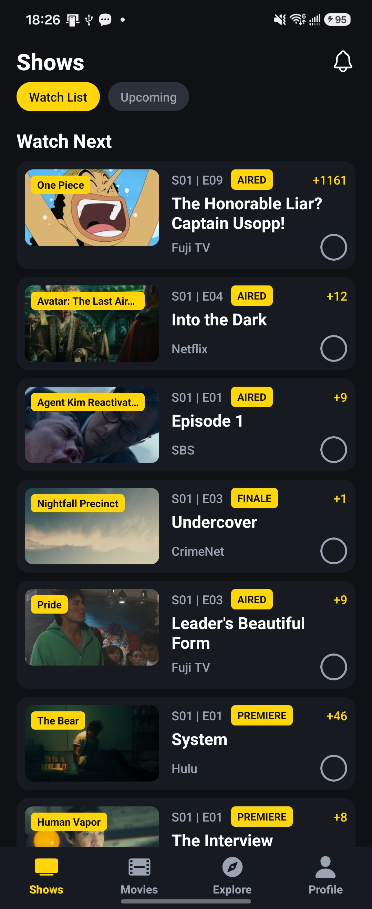</td>
    <td align="center">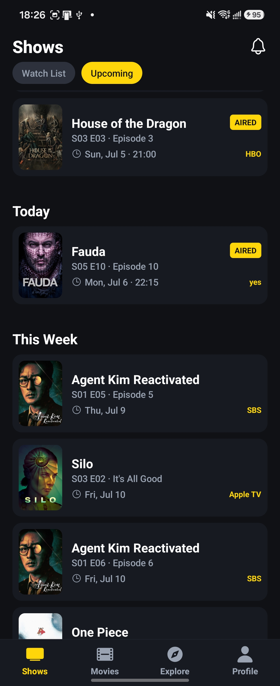</td>
    <td align="center">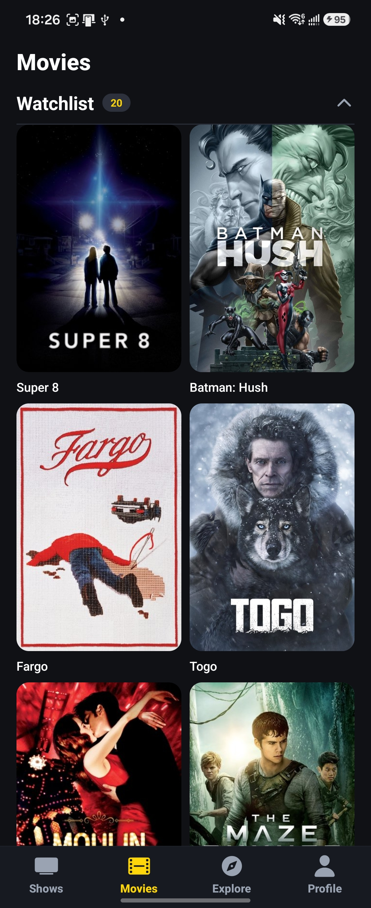</td>
  </tr>
  <tr>
    <td width="33%" align="center"><b>Explore</b></td>
    <td width="33%" align="center"><b>Show Page</b></td>
    <td width="33%" align="center"><b>Show About</b></td>
  </tr>
  <tr>
    <td align="center">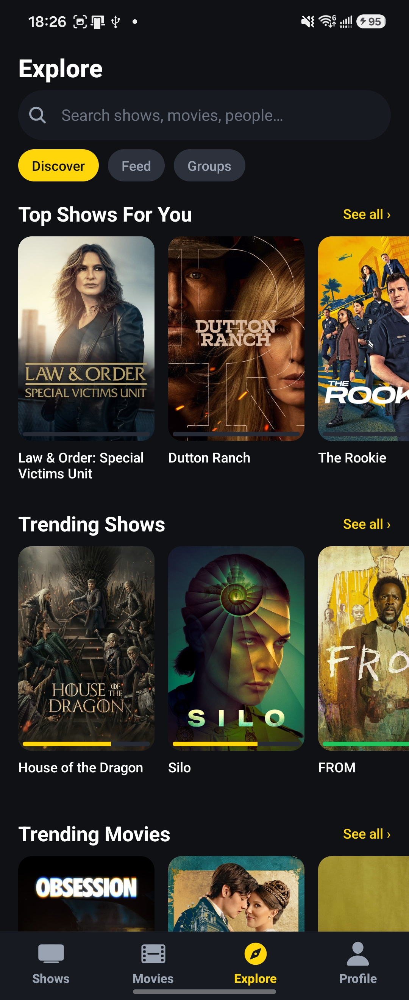</td>
    <td align="center">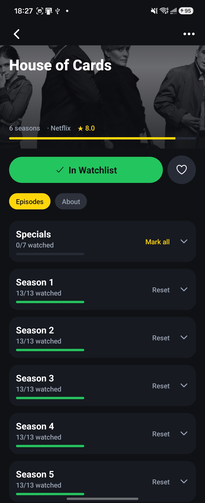</td>
    <td align="center">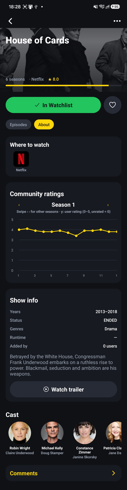</td>
  </tr>
  <tr>
    <td width="33%" align="center"><b>Episode Details</b></td>
    <td width="33%" align="center"><b>Profile</b></td>
    <td width="33%" align="center"><b>Notifications</b></td>
  </tr>
  <tr>
    <td align="center">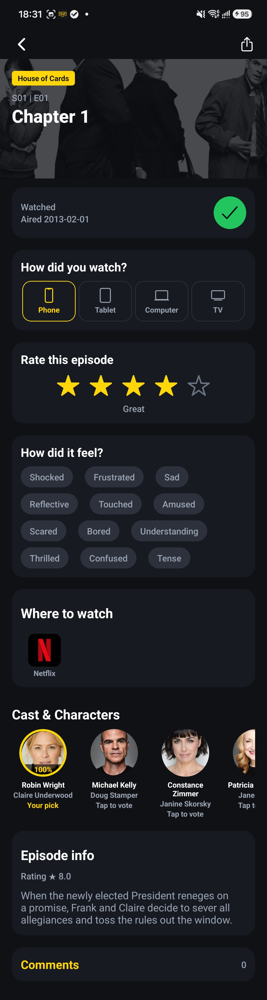</td>
    <td align="center">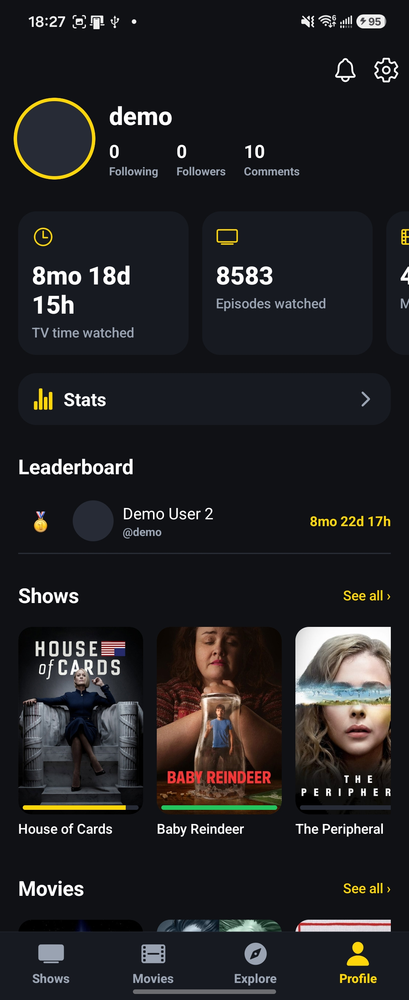</td>
    <td align="center">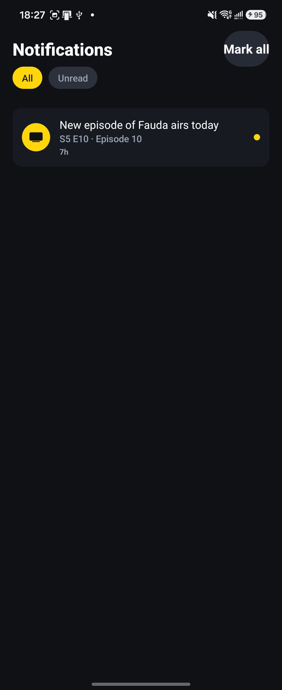</td>
  </tr>
  <tr>
    <td width="33%" align="center"><b>Comments</b></td>
    <td width="33%" align="center"><b>TV Time Import</b></td>
    <td width="33%"></td>
  </tr>
  <tr>
    <td align="center">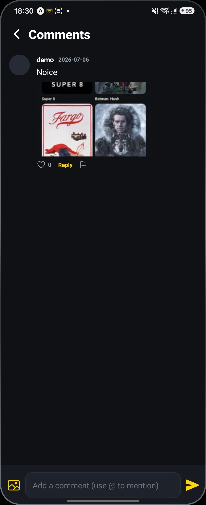</td>
    <td align="center">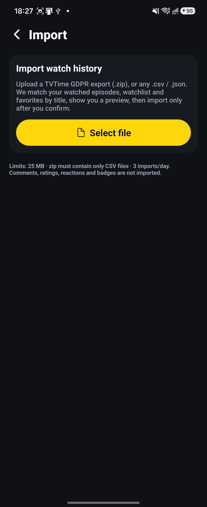</td>
    <td align="center"></td>
  </tr>
</table>

### Admin Console

<table>
  <tr>
    <td width="33%" align="center"><b>Admin Dashboard</b></td>
    <td width="33%" align="center"><b>User Management</b></td>
    <td width="33%" align="center"><b>Hydration Jobs</b></td>
  </tr>
  <tr>
    <td align="center">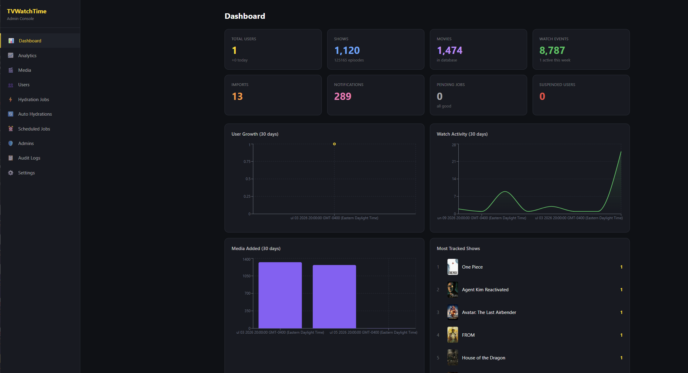</td>
    <td align="center">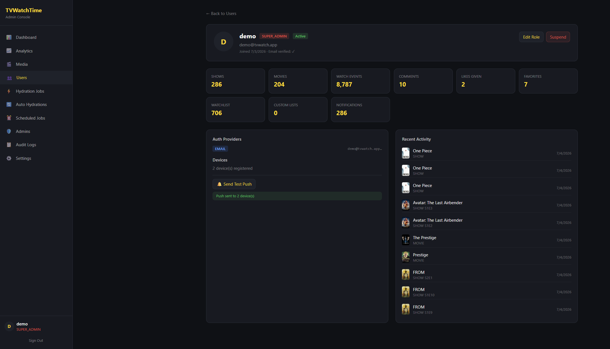</td>
    <td align="center">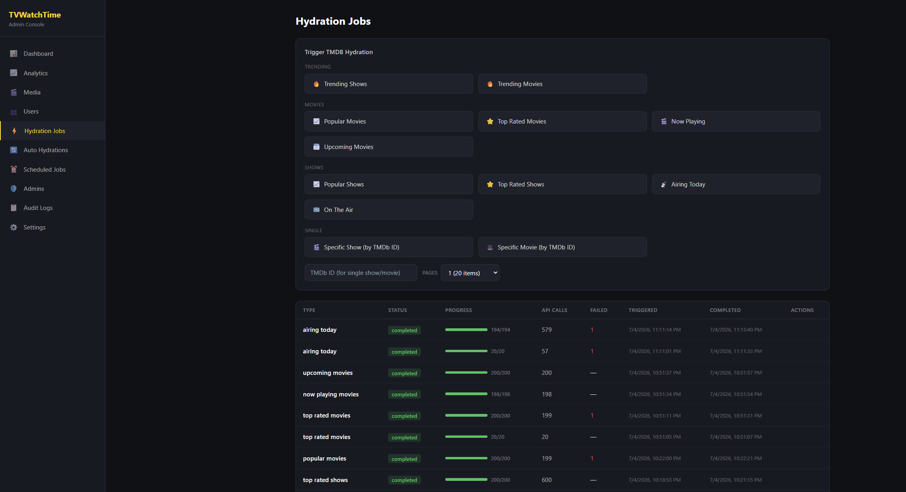</td>
  </tr>
</table>

---

## Features

### Tracking

- **Shows and movies**: mark episodes, seasons, or films as watched
- **Watchlist and favorites**: keep separate lists for what you plan to watch and what you love
- **Watch-next view**: group titles by recent activity, airing schedule, and viewing history
- **Upcoming episodes**: see recent and future episodes, with automatic scrolling to today
- **Custom lists**: create personal collections

### Import

- **TV Time import**: upload your GDPR export in ZIP, CSV, or JSON format
- **History migration**: carry over watched history, watchlist items, favorites, and progress
- **Review before applying**: preview matches, fix unmatched items, and roll back when needed
- **Special season handling**: excludes S0/specials from progress calculations

### Community

- **Comments with images**: one-level threads, mentions, moderated image uploads
- **Ratings and reactions**: rate episodes and add mood reactions
- **Character votes**: vote for favorite characters by episode
- **Leaderboards**: compare watch time with friends across shows, movies, or both

### Insights

- **Stats**: total watch time, watched episodes, watched movies, genre charts, and network charts
- **Season rating charts**: compare community ratings with your own
- **Catch-up predictions**: estimate when you will finish a show based on your pace
- **Badges**: unlock milestones as you watch

### Notifications

- **Episode reminders**: get notified for premieres and upcoming episodes
- **Push support**: works with Expo Go, Firebase dev builds, and self-hosted relay mode
- **In-app notification center**: manage read status, categories, and preferences

### Self-hosting

- Run a private backend and connect the app to your own instance
- Use the public mobile app with a self-hosted backend URL
- Use the public push relay when needed, subject to rate limits

---

## Tech Stack

| Layer | Technology |
|-------|------------|
| Mobile | React Native + Expo SDK 54, Expo Router 6, expo-notifications |
| Backend | NestJS 10, Prisma 5, PostgreSQL 16 |
| Cache / Queue | Redis 7, BullMQ |
| Notifications | Expo Push API, Firebase Admin, Push Relay |
| Storage | S3-compatible storage, MinIO in development |
| Admin | Next.js 14, Tailwind, Recharts |
| Metadata | TMDb, TVmaze |
| Moderation | OpenAI |
| Deployment | Docker |

---

## Get the App

The beta will be available for Android and iOS soon.

Star the repository or join the Discord to follow progress and get notified when the beta is available.

<div align="center">

[**Join the Discord**](https://discord.gg/g9JBPUeqQV) · [**Report a bug**](../../issues) · [**Request a feature**](../../issues/new?labels=enhancement)

</div>

---

## Self-Hosting

TVWatchTime can be run as a private self-hosted instance. You keep control of your data, and the backend stack runs in Docker.

Self-hosting is intended for personal use under the project license. Public, shared, commercial, organizational, or managed hosting requires separate written permission.

### Self-hosting options

- **Use the public app**: install the public TVWatchTime app, enable “Self-hosted backend” on the login screen, and enter your server URL. No mobile build is required.
- **Build from source**: build the mobile app yourself with your own API URL, OAuth keys, and branding.

### Prerequisites

- A VPS or server with Docker and Docker Compose installed
- A domain name with DNS records pointing to your server
- A TMDb API key
- An optional TVmaze API key for higher rate limits

### Quick deploy

```bash
# 1) Clone the repo
git clone https://github.com/Metalingus/TVWatchTime.git
cd TVWatchTime

# 2) Configure production env
cp .env.prod.example .env.prod
nano .env.prod
# Fill in passwords, JWT secret, TMDb key, and BOOTSTRAP_SUPER_ADMIN_EMAIL

# 3) Pull pre-built images from GHCR
docker compose -f docker-compose.prod.yml pull

# 4) Start the stack
docker compose -f docker-compose.prod.yml up -d

# 5) Apply the database schema
docker compose -f docker-compose.prod.yml exec api \
  pnpm --filter @tvwatch/api prisma db push

# 6) Verify the API
curl https://api.yourdomain.org/health
# Expected: {"status":"ok"}
```

Set three DNS A records to your server IP:

- `yourdomain.org`: public site, privacy policy, and terms
- `api.yourdomain.org`: API backend
- `admin.yourdomain.org`: admin console

[Caddy](Caddyfile) handles HTTPS automatically through Let’s Encrypt.

### Create your super admin

Set the following value in `.env.prod`:

```env
BOOTSTRAP_SUPER_ADMIN_EMAIL=you@email.com
```

Then register an account with that email in the mobile app. On the login screen, enable “Self-hosted backend” and enter your API URL.

That account will be promoted to `SUPER_ADMIN` and prompted to set a new password.

### Build from source

```bash
docker compose -f docker-compose.prod.yml build
```

### Push notifications

Self-hosted instances can send push notifications through the public TVWatchTime relay if they do not use their own Expo token.

Set the following values in `.env.prod`:

```env
PUSH_MODE=relay
PUSH_RELAY_URL=https://api.tvwatchtime.org/api
```

Push relay usage is rate-limited per device.

### Optional features

Leave optional values blank to disable the related feature.

| Feature | Required env | Behavior when missing |
|---------|--------------|-----------------------|
| Comment images | S3 / MinIO config | Feature disabled |
| User avatars and covers | S3 / MinIO config | Falls back to local server files |
| Image moderation | `OPENAI_API_KEY` | Moderation skipped |
| Google login | `GOOGLE_CLIENT_ID` / `GOOGLE_CLIENT_SECRET` | Button hidden in app |
| Facebook login | `FACEBOOK_APP_ID` / `FACEBOOK_APP_SECRET` | Button hidden in app |
| Push notifications | `EXPO_ACCESS_TOKEN` | Push disabled, in-app notifications remain available |
| TVmaze air times | `TVMAZE_API_KEY` | Works without a key at lower rate limits |

See [`docs/ENVIRONMENT.md`](docs/ENVIRONMENT.md) for the full environment variable reference.

### Backups

Example daily PostgreSQL backup:

```bash
0 4 * * * docker exec tvwatch-postgres pg_dump -U tvwatch tvwatch \
  | gzip > /backups/tvwatch-$(date +\%Y\%m\%d).sql.gz \
  && find /backups -mtime +7 -delete
```

---

## For Contributors

### Repository layout

```text
TVWatchTime/
  apps/
    api/         # NestJS backend (@tvwatch/api)
    mobile/      # Expo app (@tvwatch/mobile)
    admin/       # Next.js admin console (@tvwatch/admin)
  packages/
    shared/      # @tvwatch/shared types and API contracts
  docs/          # PRD, architecture, API contract, roadmap, and references
  public-site/   # Privacy policy, terms of use, and landing page

  docker-compose.yml          # Development infra: Postgres, Redis, MinIO
  docker-compose.prod.yml     # Production stack: API, admin, Caddy, MinIO
  Caddyfile                   # Reverse proxy and automatic HTTPS
```

### Quick start

```bash
# 1) Install dependencies
pnpm install

# 2) Start local infrastructure
docker compose up -d

# 3) Configure env files
cp .env.example .env
cp apps/mobile/app.example.json apps/mobile/app.json

# 4) Prepare the database
pnpm db:generate
pnpm db:migrate
pnpm db:seed

# 5) Run the development servers
pnpm dev:api
pnpm dev:mobile
```

When `TMDB_API_KEY` is not set, the backend serves seeded mock metadata so the app remains usable offline during development.

### Scripts

| Script | Description |
|--------|-------------|
| `pnpm dev:api` | Run the NestJS backend in watch mode |
| `pnpm dev:mobile` | Start the Expo development server |
| `pnpm --filter @tvwatch/admin dev` | Start the admin console on port 3000 |
| `pnpm db:migrate` | Create and apply Prisma migrations |
| `pnpm db:seed` | Seed development data |
| `pnpm typecheck` | Typecheck all workspaces |
| `pnpm lint` | Lint all workspaces |
| `pnpm test` | Run all tests |

### Documentation

| Doc | Contents |
|-----|----------|
| [`docs/DOCUMENTATION.md`](docs/DOCUMENTATION.md) | Full technical reference |
| [`docs/ENVIRONMENT.md`](docs/ENVIRONMENT.md) | Environment variables and feature fallback behavior |
| [`docs/To_DO.md`](docs/To_DO.md) | Project status tracker |
| [`docs/PRD.md`](docs/PRD.md) | Product requirements |
| [`docs/ARCHITECTURE.md`](docs/ARCHITECTURE.md) | Architecture decisions |
| [`docs/API_CONTRACT.md`](docs/API_CONTRACT.md) | Endpoint reference |
| [`docs/NOTIFICATIONS.md`](docs/NOTIFICATIONS.md) | Notification and push relay design |
| [`docs/SECURITY.md`](docs/SECURITY.md) | Security checklist |
| [`AGENTS.md`](AGENTS.md) | Contributor and agent instructions |

---

## License

This project is source-available, not open source.

You may download, run, and modify this software only for your own personal use.

You may not:

- host this software for other people;
- provide access to this software as a public, shared, hosted, or managed service;
- use this software for any commercial, business, nonprofit, educational, organizational, or community purpose;
- sell, rent, sublicense, monetize, or otherwise exploit this software;
- redistribute modified or unmodified copies without written permission.

Commercial, public, shared, hosted, managed, organizational, or community use requires a separate written license from the author.

---

<div align="center">

**Built for people who want to keep their watch history, habits, and community.**

[Discord](https://discord.gg/g9JBPUeqQV) · [Issues](../../issues)

</div>
